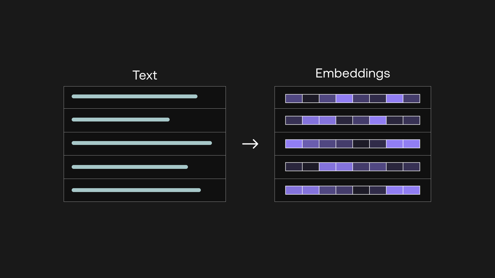

# Text-Embeddings

An embedding is a list of floating point numbers that our models use to represent text. Each token in a piece of text has an embedding. As these embeddings flow through the model, they get transformed and refined. At the end of the model, each token embedding contains information about the semantics of the text it was a part of, as well as some amount of world knowledge. Deeper models produce more information-rich embeddings, both because the model has more time to transform and refine them, and because they have a higher dimensionality (i.e. contain more numbers).

The embeddings we return are obtained by averaging the embeddings of each token in the text. The final embedding thus captures semantic information about the entirety of the text.

